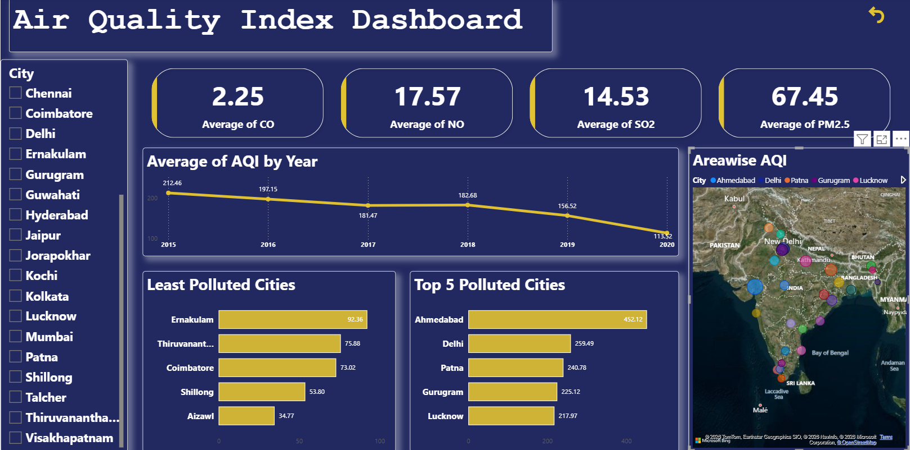

# 🌍 Air Quality Index (AQI) Dashboard

--- 

## 📊 Overview
The **Air Quality Index (AQI) Dashboard** provides a comprehensive view of air quality across multiple cities. It enables users to monitor pollution levels, analyze trends, and identify areas requiring attention.

---
 
## 🖼️ Dashboard Preview

---

## 🎯 Key Features
- 📈 Track air quality trends over time  
- 🏙️ Compare pollution levels across cities  
- 🔍 Interactive filtering using slicers  
- 📊 Clear visual representation of key metrics  

---

## 📌 Key Performance Indicators (KPIs)

- **Average CO** – Carbon monoxide levels  
- **Average NO** – Nitrogen oxide levels  
- **Average SO₂** – Sulfur dioxide levels  
- **Average PM2.5** – Fine particulate matter levels  

---

## 📊 Visualizations

- **📈 Line Chart – Average AQI by Year**  
  Shows trends and changes in air quality over time  

- **📊 Bar Chart – Top 5 Polluted Cities**  
  Highlights cities with the highest pollution levels  

- **📉 Bar Chart – Least Polluted Cities**  
  Displays cities with the cleanest air  

---

## 🎛️ Filters & Controls

- **City Name Slicer** – Focus on specific locations  
- Additional slicers for:
  - Year  
  - Pollutants  
  - Region  

---

## 🗂️ Data Source
The dataset includes:
- Pollution metrics (CO, NO, SO₂, PM2.5)  
- Yearly AQI values  
- City-level data  

---

## ⚙️ Requirements
- Power BI Desktop *(May 2024 or later recommended)*  
- No additional dependencies required  

---

## 🚀 Usage

1. Download the Power BI dashboard file  
2. Open it in Power BI Desktop  
3. Interact with filters and visuals:
   - Select cities  
   - Adjust time ranges  
   - Explore pollutant levels  
4. Hover over charts for detailed insights  

---

## 💡 Insights
- Identify long-term air quality trends  
- Compare highly polluted vs cleaner cities  
- Spot patterns that may inform policy or action  

---

## 🔮 Future Enhancements
- 🔄 Real-time data integration  
- 📊 Additional KPIs (health impact, AQI categories)  
- 🌐 Expanded geographic coverage  

---

## 📬 Contact
Feel free to contribute, raise issues, or suggest improvements!
